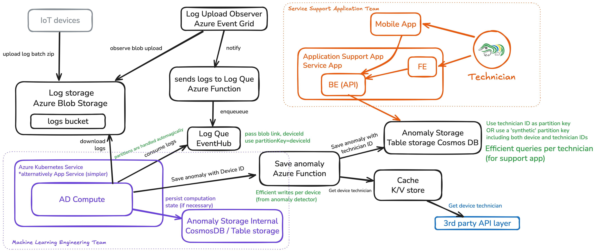

# MFF UK - NSWI152 - Cloud Application Development 
Zdeněk Tomis, 
Ondřej Kaštovský

## Architektura



## Popis flow

1. Nahrání logů do Azure Blob Storage  
   Každé IoT zařízení periodicky nahrává Zip do kontejneru Azure Blob Storage.

2. Detekce nahrání souboru Event Gridem  
    Azure Event Grid monitoruje kontejner Blob Storage a spouští notifikaci při každém nahrání souboru. Tato notifikace obsahuje   metadata o nahraném souboru (např. odkaz na blob, ID zařízení).

3. Zpracování notifikace pomocí Azure Function  
   Azure function zpracovává notifikaci z Event Gridu a pošle zprávu do Azure Event Hub. Tato zpráva obsahuje metadata o nahraném souboru a ID zařízení, což umožňuje následné zpracování. 
  
4. Event Hub pro zpracování zpráv  
   Azure Event Hub přijímá zprávy z Azure Function a zajišťuje pořadí zpráv pro jednotlivá zařízení. Zde se také provádí rozdělení zpráv do partitionů, což umožňuje škálovatelnost a paralelní zpracování pomocí škálování AD Compute komponenty.

5. AD Compute - počítání anomálií  
   Azure Kubernetes Service (AKS) hostuje komponentu AD Compute, která zpracovává zprávy z Event Hubu. Tato komponenta:

   * Stahuje logy z Azure Blob Storage.
   * Rozbaluje Zip soubory a extrahuje jednotlivé logy.
   * Aplikuje algoritmy pro detekci anomálií na extrahované logy.
   * Udržuje stav algoritmu v interní databázi, což umožňuje stateless zpracování.

    Je otázka, jestli pro AD Compute komponentu v Azure Kubernetes Service (AKS) nebo Azure App Service. Vzhledem k tomu, že AI komponenta může vyžadovat specifické prostředí, zvolili jsme AKS. Pro jednoduchost by však bylo možné použít Azure App Service.   
    Další otázkou je statefulness pro AD Compute. Pokud je stateless, můžeme odstranit AD Internal Storage komponent. Pro případ stateful zpracování jsme zahrnuli AD Internal Storage, který slouží k uložení stavu algoritmu při škálování nebo výpadcích.

6. Ukládání anomálií

    Detekované anomálie jsou ukládány do Azure Cosmos DB nebo Table Storage. Tyto databáze umožňují rychlé a efektivní dotazy jak podle zařízení, tak podle technika, což usnadňuje následné vyhledávání a správu anomálií.

    Toto dělá Azure Function, která spolu s anomáliemi ukládá i metadata o zařízení a technikovi, který je zodpovědný za dané zařízení. Pro tento účel se dotazuje na 3rd pary API, které je kvůli nevýkonnosti cachováno v Cache. Jako cache se dá použít například Azure Redis Cache.

7. Aplikace Podpora 
    Aplikace Podpora (Support App) je webová aplikace, která umožňuje technikům:  

   * Zobrazit seznam nevyřešených anomálií pro jejich zařízení.
   * Označit anomálie jako vyřešené.
  
  Další možnosti zahrnují:
   * Zobrazit podrobnosti o anomáliích.
   * Procházet historii anomálií pro jednotlivá zařízení.
   * Filtrovat anomálie.
   * Filtrovat podle zařízení.

  Očekávání je, že data budou mít takový tvar, že filtrovaní bude možné provádět na BE nebo FE a není nutné řešit v databázi.
  Toto se nevztahuje na filtrování podle technika (a device). Pokud nebude potřeba filtrovat podle device, stačí použít jednoduchý Table Storage. Pokud chceme mít efektivní dotazy podle technika a zařízení, použijeme Azure Cosmos DB a použijeme syntetický partition key, který bude kombinací technika a zařízení.


## Poznámky

- Použití Event Grid a Event Hub zároveň - Event Grid dokáže sledovat uplaody souborů do Blob Storage a posílat notifikace, které jsou následně zpracovány Azure Function. Event Hub slouží k zajištění per-device pořadí zpráv a škálovatelnosti ve formě partitioningu.
- Vlastní funkce pro ukládání anomálií je možná trochu overkill.  Přidává to ale separaci zodpovědností. AD Compute, a s tím i ML team, nyní vůbec nemusí řešit 3rd party API, cache, nebo databázi (na obojí by mohl cloud poskytnout například SDK, ale takto je to jednodušší).


## Observability

## Metriky

| Název                     | Typ        | Popis                                                                 | Jednotka   |
|---------------------------|------------|-----------------------------------------------------------------------|------------|
| `events_ingested_total`   | Counter    | Kumulativní počet úspěšně zpráv publikovaných do Event Hubs.         | 1 (count)  |
| `processing_latency_ms`   | Histogram  | Distribuce end-to-end latence zpracování (nahrání blob → detekce).    | ms         |
| `active_detection_pods`   | Gauge      | Aktuální počet AKS podů běžících detekci anomálií.                   | 1 (count)  |

 
- **Counter** (`events_ingested_total`): monotónně narůstající; vhodné pro alerty na rychlost.  
- **Histogram** (`processing_latency_ms`): bucketovaná latence (např. 0–100 ms, 100–500 ms, > 500 ms).  
- **Gauge** (`active_detection_pods`): periodicky snímaná hodnota počtu podů, odráží autoscaling.


### Endpoint

```http
GET /api/v1/technicians/{technicianId}/anomalies/unresolved
```

### Flame Graph
```
└─ API Management: GET /anomalies/unresolved
   ├─ Funkce ListUnresolvedAnomalies (HTTP trigger)
   │  ├─ Redis GET technician_devices (cache lookup)
   │  └─ CosmosDB Query anomalies (data fetch)
   └─ Transformace a HTTP odpověď
```

### Vzorové spany
```json
[
  {
    "name": "GET /api/v1/technicians/{technicianId}/anomalies/unresolved",
    "context": {
      "trace_id": "7bba9f33312b3dbb8b2c2c62bb7abe2d",
      "span_id":  "086e83747d0e381e"
    },
    "parent_id": "",
    "start_time": "2025-06-19T08:00:00.000000000 +0000 UTC",
    "end_time":   "2025-06-19T08:00:00.150000000 +0000 UTC",
    "status_code": "OK",
    "attributes": {
      "http.method":      "GET",
      "http.route":       "/api/v1/technicians/{technicianId}/anomalies/unresolved",
      "http.status_code": 200
    },
    "events": []
  },
  {
    "name": "Function ListUnresolvedAnomalies",
    "context": {
      "trace_id": "7bba9f33312b3dbb8b2c2c62bb7abe2d",
      "span_id":  "4c3d2e1f0a9b8c7d"
    },
    "parent_id": "086e83747d0e381e",
    "start_time": "2025-06-19T08:00:00.010000000 +0000 UTC",
    "end_time":   "2025-06-19T08:00:00.120000000 +0000 UTC",
    "status_code": "OK",
    "attributes": {
      "faas.execution": "exec-789",
      "function.name":  "ListUnresolvedAnomalies"
    },
    "events": []
  },
  {
    "name": "Redis GET technician_devices",
    "context": {
      "trace_id": "7bba9f33312b3dbb8b2c2c62bb7abe2d",
      "span_id":  "a1b2c3d4e5f60708"
    },
    "parent_id": "4c3d2e1f0a9b8c7d",
    "start_time": "2025-06-19T08:00:00.020000000 +0000 UTC",
    "end_time":   "2025-06-19T08:00:00.023000000 +0000 UTC",
    "status_code": "OK",
    "attributes": {
      "db.system":    "redis",
      "db.operation": "GET",
      "db.redis.key": "technician:0c8af4d3:devices"
    },
    "events": []
  },
  {
    "name": "CosmosDB Query anomalies",
    "context": {
      "trace_id": "7bba9f33312b3dbb8b2c2c62bb7abe2d",
      "span_id":  "b9c8d7e6f5a40312"
    },
    "parent_id": "4c3d2e1f0a9b8c7d",
    "start_time": "2025-06-19T08:00:00.025000000 +0000 UTC",
    "end_time":   "2025-06-19T08:00:00.100000000 +0000 UTC",
    "status_code": "OK",
    "attributes": {
      "db.system":             "cosmosdb",
      "db.operation":          "Query",
      "db.cosmosdb.container": "anomalies",
      "net.peer.name":         "myaccount-cosmos.documents.azure.com"
    },
    "events": []
  }
]
```

## Limitace / Možnosti vylepšení

* Není zohledněno, že by se mohlo změnit přiřazení techniků k zařízením.
* Není řešena autentikace a autorizace, předpokládá se, že jsou implementovány, ale nejsou v tomto návrhu podrobně popsány.
  * Role-Based Access Control - Technici by měli mít přístup pouze k zařízením, která jsou jim přiřazena.
* Real time updates pro UI (mobile & FE). Při velkém množství anomálií by bylo vhodné implementovat WebSockets nebo SignalR pro real-time notifikace místo periodického dotazování.
* Výpadky třetích stran API (např. pro získání informací o technicích) nejsou řešeny, předpokládá se, že jsou cachovány a případné výpadky jsou tolerovány. Do budoucna by bylo možné implementovat fallback mechanismy.
* Azure Key Vault pro bezpečné uložení citlivých informací, jako jsou přístupové klíče k API nebo databázím.
* Pokud by to nějak šlo, mohli bychom přeskočit Event Grid a Function a integrovat přímo Blob → Event Hub.
* Nyní nahrávají zařízení logy přímo do Blob Storage. Pokud bychom například chtěli změnit bucket, nebo přidat další zpracování, bylo by potřeba změnit kód na všech zařízeních. Zde by šla přidat další vrstva, například Azure Function, která by zpracovávala nahrávání logů a umožnila by snadnější změny v budoucnu.