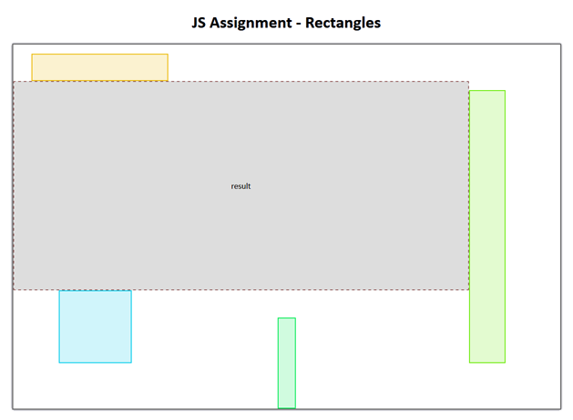

Consider the following situation. You are creating a web page with complex component layout. It must ensure, that the components do not overlap. The layout is dynamic, thus computed by JavaScript code. All components can be represented as bounding rectangles, which have absolute coordinates of top-left corner and size (width and height) in pixels.

You are being assigned a partial task from the scenario. Write a JavaScript function `maxFreeRect(width, height, rects)`, which receives the size of the component area (`width` and `height`) and an array of already placed components (i.e., their bounding rectangles `rects`). The `rects` array holds objects with properties `left`, `top`, `width`, and `height` which represent the top-left coordinates and size of the rectangle. The function returns the largest (in the terms of covered area) possible rectangle, which can fit the current layout without overlapping with any of the existing rectangles. If there are multiple such rectangles, the function will return any one of them.

The result should be represented in the same manner as the inputs -- as an object with `left`, `top`, `width`, and `height` properties. All coordinates are zero-based.

For the debugging purposes, we provide [a web page that utilizes the desired function](webpage.zip). The skeleton of the function is already prepared in `solution/solution.js`. This is, how a correct result looks on sample data:

ReCodEx evaluates your solution in [Node.js](https://nodejs.org/) environment. If you wish to test this CLI version, download a [testing script](node-cli.zip).

**Submit only the `solution.js` file in ReCodEx**. You also need to hold on to the prescribed function name and export protocol of Node.js (the `module.exports` structure) as outlined in the sample files.

A few hints (not all hints are useful for all possible approaches):

-   The `sort()` method uses string comparator as a default. When applied on an array of numbers, it converts the numbers into strings and sort them lexicographically. Use custom comparator to handle numbers correctly.
-   An easy way exists that allows you to test that two intervals overlap. You need to cross-compare the beginnings and ends of both intervals. I.e., for intervals `[start1, end1)` and `[start2, end2)` the overlapping condition can be written as `start1 < end2 && start2 < end1`.
-   If you get an urge to use recursion in your solution, resist it. If the temptation is too strong, purge your entire code and start all over.